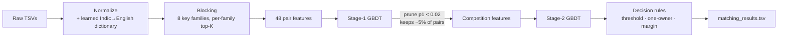

# ML Challenge 2026: Business Entity Resolution

Match noisy business records across three sources (about 12.5M records, US and India) without any
external data.

**Result: macro F0.5 = 0.968** (out-of-fold, on training entities held out from every learned
component). The untuned baseline scored 0.789.

| | Baseline (tuned) | **Final** |
|---|:-:|:-:|
| Blocking recall (ceiling) | 0.929 | **0.970** |
| Mean precision | 0.975 | **0.991** |
| Mean recall | 0.842 | **0.932** |
| Singleton accuracy | 0.878 | **0.961** |
| **Macro F0.5** | 0.917 | **0.968** |

---

## Contents
1. [The problem](#1-the-problem)
2. [Solution at a glance](#2-solution-at-a-glance)
3. [Key findings](#3-key-findings)
4. [Score progression](#4-score-progression)
5. [How it works](#5-how-it-works)
6. [Reproducing the results](#6-reproducing-the-results)
7. [Repository layout](#7-repository-layout)
8. [Limitations and next steps](#8-limitations-and-next-steps)

---

## 1. The problem

For every business in **Source 1** (S1, deduplicated), find all records in **Source 2** and
**Source 3** that describe the same business.

| Split | S1 | S2 | S3 |
|---|--:|--:|--:|
| Train (with ground truth) | 2,206,821 | 5,034,616 | 5,285,603 |
| Test | 1,732,544 | 4,887,273 | 5,082,316 |

**Scoring.** Macro F0.5 per S1 entity. Precision is weighted about twice as heavily as recall. An S1
entity with no true match (a *singleton*, 5.6% of entities) scores 1 only if it gets an **empty** list.

**Rules.** Only the provided files may be used: no geocoding, APIs or external datasets. The test
split has no labels and is used only for the final run.

**The noise is deliberate and heavy:**

| Noise | Example |
|---|---|
| Accents, leetspeak, casing | `Lumay Bóral`, `PUJOL5 SILVER`, `Malc0lm-Tower` |
| Indic scripts (9 of them) | `श्री टेक्नोलॉजी प्राइवेट लिमिटेड` for *Sree Technology Private Limited* |
| Website-style names | `siprivate.com` for **S**hyam **I**nvestments **Private** |
| Random replacement names | `Novidova`, `LUMFLUXDREX`, `Yumabelo (ID: 58515)` |
| Look-alike distractors | `Grv Medical Centre Corp` vs `GRV MEDICAL CENTRE HOLDINGS CORP` at the same address, and *not* a match |
| Shuffled / abbreviated addresses | `OH, Columbus, 5559 Orville Avenue`; state as code, name or native script |
| Noisy house numbers | `2204` vs `204`, `1056` vs `1056c` vs `1056-1060`, `194` vs `178` on true matches |
| Missing addresses | about 4% of records |

## 2. Solution at a glance



- **Blocking** finds about 80 candidates per S1 entity from 10M+ records while keeping 97% of the true
  pairs.
- **Features** are designed around each error cause found in analysis (Section 3).
- **A two-stage stacked model:** stage 2 sees how every pair compares with its competitors, which is a
  learned version of "each record belongs to one business".
- **Streaming architecture:** the test run handles 140M candidate pairs in 63 minutes with S1
  processed in 100k-entity chunks, so memory stays flat.

## 3. Key findings

Every change was driven by grouping errors by cause (`code/analyze.py`). The ten findings that
mattered most:

**1. Blocking lost pairs to its own limits, not to missing keys.**
The baseline missed 7.1% of true pairs:
- 63% were cut by the per-entity top-40 cap: the many neighbours at the same address outscored a
  name-only match;
- 33% shared only keys dropped as too common;
- only 3% shared no key at all.

Separate top-K lists for name keys and address keys, plus token-pair keys, raised recall from
**0.929 to 0.965** for only 7% more pairs.

**2. Names come from a small vocabulary, so single tokens make poor keys.**
Tokens like `rocky` or `center` appear in thousands of records. Pairs of tokens (`p:cardiology:rocky`)
are rare and precise.

**3. Indic scripts are best handled by learning a dictionary, not by transliterating.**
- 753k S2/S3 names are in Indic scripts, but they use only **1,347 distinct tokens**.
- Generic transliteration gives `shrii tteknolonjii`, which never lines up with `Sree Technology`.
- Aligning tokens in ground-truth pairs maps 1,319 of those tokens to English (`टेक्नोलॉजी` →
  `technology`). This is learned only from entities outside the evaluation sample.

**4. Most false positives are deliberate distractors, not near-duplicates of true matches.**
- 26% of S2/S3 records belong to **no** S1 entity, and 78% of false positives were such records.
- They are the S1 name with one word added or replaced, at the same address.
- The fix: fuzzy token alignment. The model learns whether the *unmatched* token is a typo or a real
  replacement word, using that token's IDF (`holdings`, `noodles`).

**5. House numbers are noisy even on true matches.**
- 37% of the baseline's missed matches had "conflicting" house numbers (`2204`/`204`, `131`/`31`, `405`/`406`).
- A binary conflict flag was replaced by graded features: containment in each direction, relative
  numeric distance and digit-string similarity.

**6. Random replacement names can be recognised.**
Tokens like `Novidova` never occur in any S1 name. The share of such unseen tokens tells the model to
trust the address instead of the name.

**7. Some missing-address cases can't be solved, and the model should decline them.**

| S1 entities with that exact name | Share of address-less exact-name candidates that are true matches |
|---|--:|
| 1 | 50% (the model separates them well: mean score 0.90 vs 0.05) |
| 2–5 | 18–27% |
| more than 20 | 2% |

When several S1 entities share the name, an address-less record is genuinely ambiguous. Under F0.5
it's better to predict nothing.

**8. The decision rules were already near-optimal, so gains had to come from better scores.**
- The relative-margin rule discards 3.8k true pairs, but removing it lowers F0.5 (0.9629 → 0.9605).
- An expected-F0.5-optimal rule, choosing per entity the best top-k prefix or nothing, tied at 0.9628.

**9. The competition features help the most on singletons.**
The best competing S1 claimant for each record and the rank within each entity (stage 2) raised
singleton accuracy from 0.943 to **0.961**.

**10. More training data kept helping.**
The learning curve rose about 0.002 F0.5 per doubling of data. Training on 1/4 of S1 instead of 1/20
added **+0.0037**. That training set keeps every true pair and every hard negative, plus 10% of the
easy negatives weighted ×10, so 6.6M rows stand in for 44M.

## 4. Score progression

Measured on train, on a fixed 1/20 sample of S1 (109,970 entities, 380,789 true pairs). ML scores are
2-fold out-of-fold, with folds split by S1 entity.

| # | Change | Blocking recall | Macro F0.5 |
|---|---|:-:|:-:|
| 0 | Provided baseline, rules matcher (untuned) | 0.929 | 0.789 |
| 0 | Provided baseline, ML matcher (tuned) | 0.929 | 0.917 |
| 1 | Token-pair / full-name / number-pair keys, per-family top-K | 0.965 | – |
| 2 | Learned Indic→English dictionary | 0.970 | – |
| 3 | 20 new error-driven features + 2-stage stacked model | 0.970 | 0.963 |
| 4 | S1 name- and address-count features, 30% faster blocking join | 0.970 | 0.964 |
| 5 | 5× larger weighted training set, bigger model | 0.970 | **0.968** |

Every experiment, including the ones that were rejected, is in
[`output/logs/experiments.md`](output/logs/experiments.md).

## 5. How it works

<details>
<summary><b>Normalization</b> (<code>code/normalize.py</code>)</summary>

- **Names:**
  - Indic tokens go through the learned dictionary; everything is then transliterated to ASCII and
    lower-cased.
  - Website names are reduced to their stem, glued-on phone numbers are removed, leetspeak is fixed.
  - Honorifics (`shri`, `m/s`) and legal suffixes (`pvt`, `ltd`, `llc`; on transliterated names also
    by phonetic skeleton) are removed.
  - Duplicated words are dropped.
- **Addresses:**
  - State names are removed in all three forms: full name, code and native script.
  - Unit and PO-box decorations are removed; street types are abbreviated.
  - Words and house numbers are kept as separate sets, because address components are often shuffled.
- **Caching:** results are cached per source, keyed on the file plus the code, so later runs skip
  about 6 minutes.
</details>

<details>
<summary><b>Blocking</b> (<code>code/blocking.py</code>)</summary>

| Family | Keys |
|---|---|
| Name | token `n:`, token pair `p:`, whole compact name `f:`, phonetic skeleton `k:`, 6-character prefix `c:` |
| Address | number + word `a:`, number pair `aa:`, word pair `w:` |

- Keys shared by more than 1,000 S2/S3 records are dropped.
- **Scores:** each pair gets a name score and an address score, each the sum of 1/key-size over the shared keys.
- **Kept per entity and source:** the union of the top 20 by name, top 20 by address and top 30 by total.
- **Implementation:** each S2/S3 key table (about 75M rows) is built once and sorted. S1 chunks are
  joined against it with `searchsorted`.
</details>

<details>
<summary><b>Features</b> (<code>code/features.py</code>, 48 in total)</summary>

- **Name similarity:** token-set, token-sort, ratio, partial and skeleton similarity (rapidfuzz, vectorised).
- **IDF-weighted overlaps:** name and address Jaccard / containment, specificity of the shared tokens.
- **House numbers:** conflict, containment in each direction, relative distance, digit similarity.
- **Token alignment:** unmatched tokens on each side and the IDF of the rarest one; soft alignment score.
- **Unseen-in-S1 token share:** detects random replacement names.
- **Website names:** token containment in the domain, initials match.
- **Specificity:** how many records or S1 entities share this exact name or address.
- **Blocking scores and flags:** address missing, transliterated, domain.

The per-pair Python loop runs in a 12-process pool.
</details>

<details>
<summary><b>Model and decisions</b> (<code>code/match.py</code>, <code>code/tune.py</code>)</summary>

- **Stage 1:** `HistGradientBoostingClassifier` (1,000 iterations, learning rate 0.05, 127 leaves,
  early stopping) on the pair features.
- **Pruning:** pairs with p1 < 0.02 are dropped. This keeps about 5% of pairs and loses 0.2% of true pairs.
- **Stage 2:** the same features plus competition features built from **out-of-fold** p1:
  - within the S1 entity: best score, gap to it, rank, number of strong candidates;
  - within the S2/S3 record: best *other* S1 claimant, gap to it, number of claimants.
- **Decisions:**
  1. Keep pairs with score ≥ 0.55.
  2. One-owner rule: each S2/S3 record goes to its best S1 entity only.
  3. Within an entity, drop candidates more than 0.30 below its best.
- **Honest evaluation:** 2-fold cross-validation by S1 entity. Scores are reported only on entities
  never used to build the dictionary. Thresholds are tuned by coordinate ascent on out-of-fold scores.
</details>

## 6. Reproducing the results

The raw data isn't in this repository. Place the provided files as
`data/data_train/train_source{1,2,3}.tsv`, `data/data_train/train_ground_truth.tsv` and
`data/data_test/test_source{1,2,3}.tsv`.

```bash
python -m venv .venv && source .venv/Scripts/activate  # Python 3.12 (Windows: .venv\Scriptsctivate)
pip install -r requirements.txt

python code/build_translit.py                                     # Indic→English dictionary
python code/run_pipeline.py --split train --evaluate --sample 20  # features, 1/20 of S1       ~9 min
python code/tune.py --matcher ml                                  # first model
python code/run_pipeline.py --split train --sample 4 --collect    # weighted training set     ~20 min
python code/tune.py --matcher ml --eval-sample 20                 # final model + thresholds  ~12 min
python code/run_pipeline.py --split test --matcher ml             # test predictions          ~63 min
python code/check_submission.py                                   # format checks
```

Timings are on a 24-thread, 32 GB Windows machine.

To skip training: `output/model.pkl`, `output/best_params_ml.json` and `output/translit_dict.json` are
committed, so only the last two commands are needed.

## 7. Repository layout

```
code/
  normalize.py        name / address normalization
  build_translit.py   learns the Indic→English token dictionary from training pairs
  data_io.py          TSV reading, normalization cache, output writers
  blocking.py         key families, BlockIndex (sorted keys + searchsorted join)
  features.py         48 pair features, multiprocess pair loop
  match.py            rules scorer, 2-stage ML scorer, competition features, decision rules
  tune.py             cross-validated training + threshold tuning (rules or ml)
  run_pipeline.py     end-to-end runner (store / stream / collect / blocking-only modes)
  analyze.py          blocking-miss and matching-error analysis grouped by cause
  evaluate.py         macro F0.5 metric
  check_submission.py output format checks
  config.py           all paths and tunables
output/
  matching_results.tsv   test predictions (one row per test S1 entity)
  model.pkl              final stacked model
  best_params_ml.json    tuned threshold / margin
  translit_dict.json     learned Indic→English dictionary
  logs/                  experiment log and every run log
Documentation_template.md  full methodology write-up
```

`candidate_pairs.tsv` (1.8 GB) and `submission.zip` are generated by the pipeline but aren't
committed, because they exceed GitHub's file-size limit.

## 8. Limitations and next steps

- **Blocking ceiling of 0.970.** The remaining misses are mostly address-less records with very common
  names. Recovering them would multiply the candidate count for little matching gain.
- **Training on 1/4 of S1.** sklearn's gradient boosting converts inputs to float64, so the full ~175M
  pairs would need more than 60 GB of RAM. A float32 booster such as LightGBM could train on all of it;
  the learning curve suggests about +0.002.
- **Hard distractors remain the main source of false positives:** the same name with a slightly changed
  house number, or one added word.
- **Assumption:** the learned artefacts (dictionary, model) assume the test split shares the training
  split's vocabulary and noise generator. All pipeline statistics on test matched train closely.
